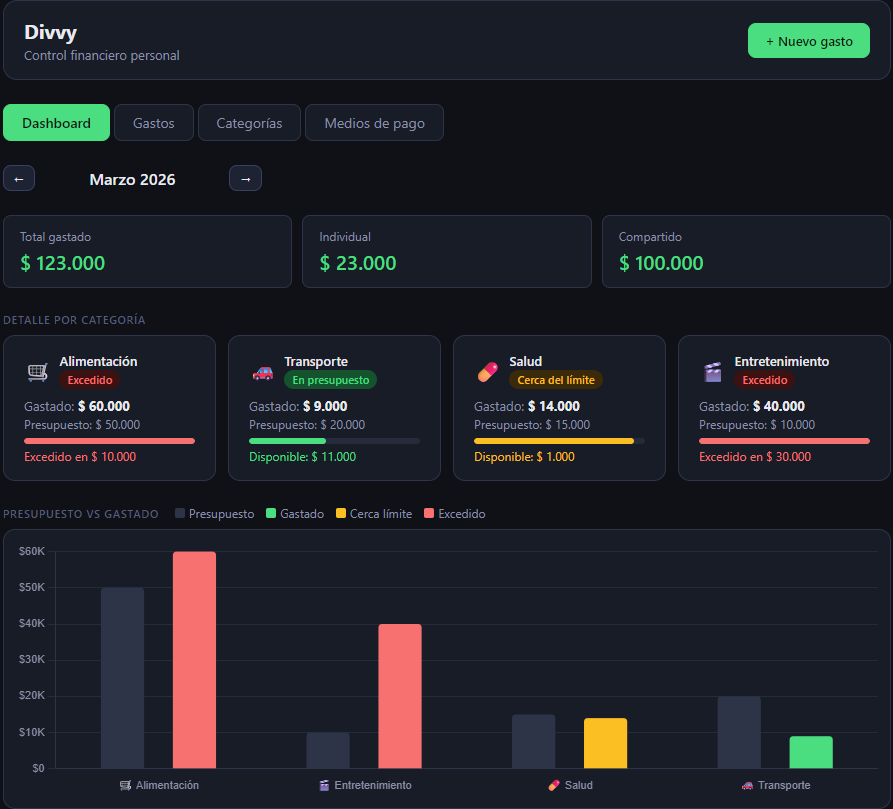

# 💸 Divvy

Track your expenses, split the costs, keep the friendships 💸


*(screenshot coming soon)*

---

## ✨ Features

- 📊 **Monthly dashboard** — budget vs. spent per category with color-coded status (green / amber / red)
- 💰 **Expense tracking** — log expenses with date, description, category, payment method and currency (ARS / USD / EUR)
- 🤝 **Shared expenses** — mark any expense as shared (auto-splits 50/50 automatically)
- 🗂️ **Categories** — create custom categories with emoji icons and monthly budgets
- 💳 **Payment methods** — manage your cards, wallets and cash methods
- 📥 **CSV export** — download monthly expense reports
- 🌙 **Dark mode UI** — clean, modern interface

---

## 🗺️ Roadmap

> > Divvy's vision goes beyond personal finance — towards an app where friends, roommates or partners can manage their shared expenses together.

- [ ] Multi-user support with authentication
- [ ] Shared expense groups (roommates, trips, events)
- [ ] Automatic balance calculation between users
- [ ] Settle up / payment recording
- [ ] Monthly summary notifications

---

## 🛠️ Tech Stack

| Layer | Technology |
|---|---|
| Frontend | React 18, Vite, Chart.js, CSS Modules |
| Backend | FastAPI (Python 3.12) |
| Database | MySQL 8.0 |
| ORM | SQLAlchemy 2.0 |
| Migrations | Alembic |
| Containerization | Docker, Docker Compose |
| Deployment | Railway |

---

## 🏗️ Architecture
```
divvy/
├── backend/
│   ├── main.py               ← App entry point + startup
│   ├── database.py           ← MySQL connection (SQLAlchemy)
│   ├── models.py             ← Database models
│   ├── schemas.py            ← Pydantic validation schemas
│   ├── alembic/              ← Database migrations
│   │   └── versions/
│   │       ├── 0001_initial.py
│   │       └── 0002_example.py
│   └── routes/
│       ├── gastos.py
│       ├── categorias.py
│       └── medios.py
└── frontend/
|   └── src/
|       ├── api/              ← API client (axios)
|       ├── components/       ← Reusable components
|       ├── pages/            ← Dashboard, Expenses, Categories, Payment Methods
|       ├── store.jsx         ← Global state (React Context)
|       └── utils.js          ← Helpers (formatting, CSV export)
├── screenshots/              ← App screenshots for README
│   └── dashboard.png        
```

---

## 🚀 Run Locally

### Prerequisites
- Docker Desktop
```bash
# 1. Clone the repo
git clone https://github.com/rominacuadra/divvy.git
cd divvy

# 2. Create local environment files
cp backend/.env.example backend/.env
cp frontend/.env.example frontend/.env.local

# 3. Start all services
docker-compose up --build
```

| URL | Service |
|---|---|
| http://localhost:5173 | Frontend (React) |
| http://localhost:8000/docs | API docs (Swagger) |
| http://localhost:8000/health | Health check |

> **Windows users:** Make sure Docker Desktop is running before executing the command.

### Access from mobile (same WiFi network)
```bash
# Mac/Linux
ipconfig getifaddr en0

# Windows — look for IPv4 Address
ipconfig
```

Open on mobile: `http://YOUR_LOCAL_IP:5173`

---

## 🗄️ Database Migrations
```bash
# Apply all pending migrations
alembic upgrade head

# Auto-generate migration after model change
alembic revision --autogenerate -m "describe the change"

# Check current revision
alembic current

# Rollback one migration
alembic downgrade -1
```

---

## ☁️ Deployment

Deployed on **Railway** using two services pointing to the same GitHub repo with different root directories.

| Service | Root Directory | Environment Variable |
|---|---|---|
| Backend | `backend/` | `DATABASE_URL` |
| Frontend | `frontend/` | `VITE_API_URL` |

---

## 📄 Versión en español

[README en español →](./README.es.md)

---

## 📬 Contact

- **LinkedIn:** [linkedin.com/in/romina-cuadra](https://www.linkedin.com/in/romina-cuadra/)
- **GitHub:** [github.com/rominacuadra](https://github.com/rominacuadra)
- **Email:** [romicuadra@gmail.com](mailto:romicuadra@gmail.com)
